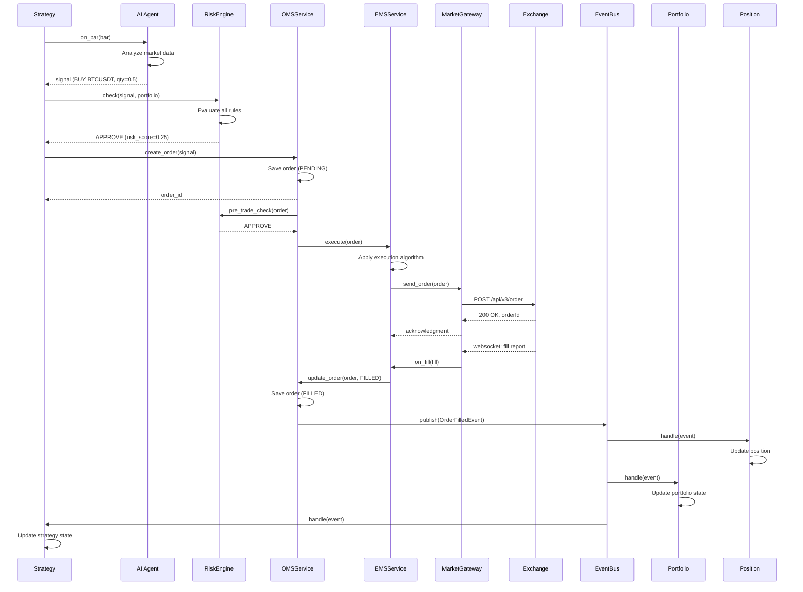

# ICYQuant 架构深潜

> 系统设计、模块交互、数据流与核心模式

## 目录

- [系统总览](#系统总览)
- [模块架构](#模块架构)
- [组件交互图](#组件交互图)
- [数据流](#数据流)
- [事件溯源设计](#事件溯源设计)
- [CQRS 模式](#cqrs-模式)
- [平台编排](#平台编排)

---

## 系统总览

### 设计理念

ICYQuant 是一个机构级量化交易平台，采用以下核心设计原则：

| 原则 | 说明 |
|------|------|
| **事件溯源** | 存储事实而非状态，确保完整审计追踪 |
| **CQRS** | 命令查询职责分离，优化读写路径 |
| **六边形架构** | 依赖倒置，核心逻辑与技术实现解耦 |
| **微服务** | 按业务能力拆分，独立部署扩展 |
| **服务网格** | Istio 提供通信安全、负载均衡、熔断 |
| **可观测性优先** | 日志、指标、追踪三位一体 |

### 技术栈

| 层次 | 技术选型 |
|------|----------|
| 语言 | Python 3.9+, FastAPI |
| 编排 | Kubernetes, Helm |
| 服务网格 | Istio |
| 数据库 | PostgreSQL 16 |
| 缓存 | Redis 7 Cluster |
| 消息队列 | Kafka (KRaft) |
| 可观测性 | Prometheus, Grafana, Jaeger |
| 安全 | JWT, OAuth2, RSA-4096, AES-256 |
| AI/ML | PyTorch, LangChain, vLLM |
| 容器 | Docker, containerd |

### 逻辑架构

```
┌──────────────────────────────────────────────────────────────────────────┐
│                         Client Layer                                     │
│  ┌──────────────┐  ┌──────────────┐  ┌──────────────────────────────────┐ │
│  │   Web UI     │  │   CLI Tool   │  │          Python SDK              │ │
│  └──────┬───────┘  └──────┬───────┘  └──────────────┬───────────────────┘ │
└─────────┼──────────────────┼─────────────────────────┼────────────────────┘
          │                  │                         │
          ▼                  ▼                         ▼
┌──────────────────────────────────────────────────────────────────────────┐
│                         Gateway Layer                                     │
│  ┌──────────────┐  ┌──────────────┐  ┌──────────────────────────────────┐ │
│  │  Nginx Ingress│  │  Istio GW    │  │         WAF / DDoS Protection     │ │
│  └──────┬───────┘  └──────┬───────┘  └──────────────┬───────────────────┘ │
└─────────┼──────────────────┼─────────────────────────┼────────────────────┘
          │                  │                         │
          ▼                  ▼                         ▼
┌──────────────────────────────────────────────────────────────────────────┐
│                         API Gateway Layer                                 │
│  ┌─────────────────────────────────────────────────────────────────────┐ │
│  │                    ICYQuant API Gateway                              │ │
│  │  ┌──────────┐ ┌──────────┐ ┌──────────┐ ┌────────────────────────┐  │ │
│  │  │ Auth MW  │ │ RateLimit│ │  Router  │ │ OpenTelemetry MW       │  │ │
│  │  └──────────┘ └──────────┘ └──────────┘ └────────────────────────┘  │ │
│  └─────────────────────────────────────────────────────────────────────┘ │
└──────────────────────────────────────────────────────────────────────────┘
          │                  │                  │
          ▼                  ▼                  ▼
┌──────────────────────────────────────────────────────────────────────────┐
│                         Service Mesh (Istio)                              │
│  ┌─────────────────────────────────────────────────────────────────────┐ │
│  │  mTLS · Retry · Circuit Breaker · Rate Limit · Load Balance        │ │
│  └─────────────────────────────────────────────────────────────────────┘ │
└──────────────────────────────────────────────────────────────────────────┘
          │                  │                  │
          ▼                  ▼                  ▼
┌──────────────────────────────────────────────────────────────────────────┐
│                         Microservices Layer                               │
│                                                                          │
│  ┌────────┐ ┌────────┐ ┌────────┐ ┌────────┐ ┌────────┐ ┌────────┐       │
│  │Research│ │   AI   │ │Backtest│ │  OMS   │ │  EMS   │ │ Risk   │       │
│  └────────┘ └────────┘ └────────┘ └────────┘ └────────┘ └────────┘       │
│  ┌────────┐ ┌────────┐ ┌────────┐ ┌────────┐ ┌────────┐ ┌────────┐       │
│  │Port-   │ │Strategy│ │Account │ │ Market │ │ Audit  │ │Plugin  │       │
│  │folio   │ │ Engine │ │ Service│ │Gateway │ │ Service│ │ Manager│       │
│  └────────┘ └────────┘ └────────┘ └────────┘ └────────┘ └────────┘       │
│                                                                          │
│  ┌──────────────────────────────────────────────────────────────────────┐ │
│  │                     Platform Orchestrator                            │ │
│  │  ┌──────────────┐  ┌──────────────┐  ┌──────────────────────────┐  │ │
│  │  │ Event Router │  │ Workflow Eng │  │   Module Registry        │  │ │
│  │  └──────────────┘  └──────────────┘  └──────────────────────────┘  │ │
│  └──────────────────────────────────────────────────────────────────────┘ │
└──────────────────────────────────────────────────────────────────────────┘
          │                  │                  │
          ▼                  ▼                  ▼
┌──────────────────────────────────────────────────────────────────────────┐
│                         Data Layer                                        │
│  ┌──────────────┐  ┌──────────────┐  ┌──────────────┐  ┌──────────────┐ │
│  │ PostgreSQL   │  │    Redis     │  │    Kafka     │  │  Lakehouse  │ │
│  │  (主从集群)  │  │  (分片集群)  │  │  (KRaft)    │  │  (对象存储) │ │
│  └──────────────┘  └──────────────┘  └──────────────┘  └──────────────┘ │
└──────────────────────────────────────────────────────────────────────────┘
          │
          ▼
┌──────────────────────────────────────────────────────────────────────────┐
│                         Observability Layer                               │
│  ┌──────────────┐  ┌──────────────┐  ┌──────────────┐  ┌──────────────┐ │
│  │ Prometheus   │  │   Grafana    │  │   Jaeger     │  │ AlertManager│ │
│  └──────────────┘  └──────────────┘  └──────────────┘  └──────────────┘ │
└──────────────────────────────────────────────────────────────────────────┘
```

---

## 模块架构

### Research 模块

```
services/research/
├── alpha/
│   ├── alpha.py              # Alpha 因子计算
│   ├── factor.py             # 因子定义与管理
│   ├── ic.py                 # 信息系数计算
│   ├── ranking.py            # 因子排名
│   └── service.py            # Alpha 研究服务
├── signal/
│   ├── model.py              # 信号模型
│   ├── ranking.py            # 信号排名
│   └── score.py              # 信号评分
├── analytics/
│   ├── pnl.py                # PnL 分析
│   └── risk.py               # 风险分析
└── service.py                # 研究服务主入口
```

**职责：**
- Alpha 因子挖掘与评估
- 信号生成与评分
- 因子正交化与组合
- IC/IR 分析
- 研究报告生成

### AI 模块

```
services/ai/
├── agents/
│   ├── decision.py           # 决策 Agent
│   ├── memory.py             # 记忆管理
│   ├── policy.py             # 策略策略
│   └── workflow.py           # 工作流编排
├── ai_cio/
│   ├── memory.py             # CIO 记忆
│   ├── service.py            # CIO 服务
│   └── strategy.py           # CIO 策略
├── llm_provider.py           # LLM 提供者
├── ai_model.py               # AI 模型管理
├── ai_service.py             # AI 服务主入口
└── risk_agent.py             # 风控 Agent
```

**职责：**
- LLM 驱动的投资决策
- 多 Agent 协作
- AI 模型推理与训练
- 智能风险管理
- 研究自动化

### Backtest 模块

```
services/backtest/
├── engine.py                 # 回测引擎核心
├── event.py                  # 回测事件
├── order.py                  # 模拟订单
├── fill.py                   # 模拟成交
├── queue.py                  # 事件队列
├── result.py                 # 回测结果
├── runner.py                 # 回测运行器
├── cost.py                   # 成本模型
├── spread.py                 # 价差模型
├── window.py                 # 滚动窗口
├── replay.py                 # K线回放
├── router.py                 # 事件路由
├── equity.py                 # 权益曲线
├── cash.py                   # 现金管理
├── health.py                 # 健康检查
└── beta.py                   # Beta 计算
```

**职责：**
- 历史数据回放
- 策略模拟执行
- 成本模型（佣金、滑点、资金费率）
- 回测结果分析
- 参数优化
- Walk-Forward 分析

### OMS (订单管理) 模块

```
services/oms/
├── api/
│   └── oms_api.py            # OMS REST API
├── models.py                 # 订单模型
├── repository.py             # 订单仓储
├── service.py                # OMS 服务
├── state.py                  # 订单状态机
└── events.py                 # 订单事件
```

**职责：**
- 订单生命周期管理
- 订单状态机驱动
- 多交易所订单路由
- 订单取消与修改
- 订单事件发布

### EMS (执行管理) 模块

```
services/order/
├── manager.py                # 订单管理器
├── service.py                # 执行服务
├── model.py                  # 订单执行模型
├── enums.py                  # 枚举类型
├── status.py                 # 执行状态
├── side.py                   # 买卖方向
├── type.py                   # 订单类型
├── mapper.py                 # 订单映射
├── orm.py                    # ORM 模型
├── events.py                 # 执行事件
├── validator.py              # 执行验证
├── publisher.py              # 事件发布
├── version.py                # 版本管理
└── fee.py                    # 费用计算
```

**职责：**
- 算法执行（TWAP, VWAP, POV）
- 智能订单路由
- 执行成本分析
- 滑点控制
- 参与率限制

### Risk 模块

```
services/risk/
├── engine.py                 # 风险引擎
├── manager.py                # 风险管理器
├── checker.py                # 风险检查器
├── rules.py                  # 规则集合
├── rule.py                   # 单条规则
├── rule_types.py             # 规则类型
├── limits.py                 # 限额管理
├── model.py                  # 风险模型
├── context.py                # 风险上下文
├── decision.py               # 决策引擎
├── enums.py                  # 枚举类型
├── exceptions.py             # 风险异常
├── providers.py              # 数据提供者
├── repository.py             # 风险仓储
├── exposure.py               # 敞口计算
├── leverage.py               # 杠杆管理
├── liquidity.py              # 流动性评估
├── drawdown.py               # 回撤监控
├── volatility.py             # 波动率分析
├── margin.py                 # 保证金管理
├── scenario.py               # 压力测试场景
├── validators.py             # 验证器
├── monitor.py                # 实时监控
├── dashboard.py              # 仪表板数据
├── audit.py                  # 风控审计
├── bootstrap.py              # 引导配置
└── service.py                # 风险服务主入口
```

**职责：**
- 实时风险检查（每笔订单）
- 组合风险监控
- 压力测试
- VaR/CVaR 计算
- 最大回撤控制
- 杠杆管理
- 流动性评估
- 风险报告生成

### Portfolio 模块

```
services/portfolio/
├── model.py                  # 组合模型
├── state.py                  # 组合状态
├── pnl.py                    # PnL 计算
├── nav.py                    # 净值计算
├── cash.py                   # 现金管理
├── drift.py                  # 漂离监控
├── kpi.py                    # KPI 计算
├── audit.py                  # 组合审计
├── event.py                  # 组合事件
├── enums.py                  # 枚举类型
├── type.py                   # 类型定义
└── service.py                # 组合服务
```

**职责：**
- 组合净值计算
- PnL 实时计算
- 现金管理
- 风险指标（夏普、索提诺、卡玛）
- 组合优化
- 基准追踪误差

### Lakehouse 模块

```
services/data/
├── marketdata/
│   ├── bar.py                # K线数据
│   └── tick.py               # Tick 数据
├── access/
│   └── acl.py                # 数据访问控制
├── factor/
│   └── ic.py                 # 因子数据
└── service.py                # 数据服务
```

**职责：**
- 行情数据存储
- 因子数据库
- 特征库
- 数据版本管理
- 数据血缘追踪

### Observability 模块

```
services/
├── metrics/
│   ├── metric.py             # 指标定义
│   ├── counter.py            # 计数器
│   ├── gauge.py              # 仪表盘
│   ├── type.py               # 指标类型
│   └── service.py            # 指标服务
├── tracing/
│   ├── span.py               # Span 定义
│   ├── trace.py              # Trace 定义
│   ├── context.py            # Trace 上下文
│   └── service.py            # 追踪服务
└── common/
    └── logger.py             # 日志服务
```

**职责：**
- Prometheus 指标导出
- OpenTelemetry 分布式追踪
- 结构化日志
- 告警路由
- 性能分析

### Security 模块

```
services/
├── security/
│   ├── jwt.py                # JWT 服务
│   ├── kms.py                # 密钥管理
│   ├── models.py             # 安全模型
│   └── rbac.py               # 基于角色的访问控制
├── auth/
│   ├── manager.py            # 认证管理器
│   ├── session.py            # 会话管理
│   ├── token.py              # Token 管理
│   ├── credential.py         # 凭证管理
│   ├── identity.py           # 身份管理
│   ├── permission.py         # 权限管理
│   ├── context.py            # 安全上下文
│   └── service.py            # 认证服务
├── secret/
│   ├── manager.py            # 密钥管理器
│   ├── rotation.py           # 密钥轮换
│   ├── service.py            # 密钥服务
│   ├── secret.py             # 密钥模型
│   ├── type.py               # 密钥类型
│   └── access.py             # 密钥访问控制
└── audit/
    ├── collector.py          # 审计收集器
    ├── event.py              # 审计事件
    ├── manager.py            # 审计管理器
    ├── model.py              # 审计模型
    ├── recorder.py            # 审计记录
    ├── rule.py               # 审计规则
    ├── store.py              # 审计存储
    ├── validator.py          # 审计验证
    ├── metadata.py           # 审计元数据
    ├── monitor.py            # 审计监控
    ├── type.py               # 审计类型
    └── service.py            # 审计服务
```

**职责：**
- JWT/OAuth2 认证
- RBAC 权限控制
- AES-256/RSA-4096 加密
- 密钥管理与轮换
- 审计日志
- 合规报告

### Platform 模块

```
platform/
├── orchestrator.py           # 平台编排器
├── runtime.py                # 运行时引擎
├── bootstrap.py              # 引导启动
├── control_plane.py          # 控制平面
├── event_router.py           # 事件路由
├── lifecycle.py              # 生命周期管理
├── plugin_manager.py         # 插件管理器
├── scheduler.py              # 任务调度器
├── service.py                # 平台服务
├── workspace.py              # 工作区管理
├── sdk/
│   ├── __init__.py           # SDK 基类
│   ├── ai_sdk.py             # AI SDK
│   ├── broker_sdk.py         # Broker SDK
│   └── data_sdk.py           # Data SDK
└── api/
    └── __init__.py           # API 入口
```

**职责：**
- 跨模块工作流编排
- 插件生命周期管理
- 统一运行时
- 模块注册与发现
- 任务调度
- 环境配置

---

## 组件交互图

### 交易执行流程

```
                          ┌──────────────┐
                          │   Strategy   │
                          │   Engine     │
                          └──────┬───────┘
                                 │
                    1. on_bar() 回调
                                 │
                                 ▼
                          ┌──────────────┐
                          │ AI Decision  │
                          │   Agent      │
                          └──────┬───────┘
                                 │
                    2. 生成交易信号
                                 │
                                 ▼
                          ┌──────────────┐
                          │   Risk       │
                          │   Engine     │
                          └──────┬───────┘
                                 │
                    3. 风险检查
                                 │
                    ┌────────────┼────────────┐
                    ▼            ▼            ▼
              4a. 通过     4b. 拒绝     4c. 需审批
                    │            │            │
                    ▼            ▼            ▼
             ┌──────────────┐  ┌──────────────┐  ┌──────────────┐
             │    OMS       │  │  Rejection   │  │  Approval    │
             │  Service     │  │  Notification│  │  Queue       │
             └──────┬───────┘  └──────────────┘  └──────┬───────┘
                    │                                    │
       5. 创建订单                                    5. 等待审批
                    │                                    │
                    ▼                                    ▼
             ┌──────────────┐                      ┌──────────────┐
             │    EMS       │                      │   Approve    │
             │  Service     │◄────────────────────┤   / Reject   │
             └──────┬───────┘                      └──────────────┘
                    │
       6. 执行订单（算法或直接）
                    │
                    ▼
             ┌──────────────┐
             │   Market     │
             │   Gateway    │
             └──────┬───────┘
                    │
       7. 发送到交易所
                    │
                    ▼
             ┌──────────────┐
             │  Exchange    │
             │  (Binance等) │
             └──────┬───────┘
                    │
       8. 成交回报
                    │
                    ▼
             ┌──────────────┐
             │   Event      │
             │    Bus       │
             └──────┬───────┘
                    │
       9. 分发事件
                    │
         ┌──────────┼──────────┐
         ▼          ▼          ▼
  ┌──────────┐ ┌──────────┐ ┌──────────┐
  │ Position │ │Portfolio │ │  Audit   │
  │ Service  │ │ Service  │ │  Service │
  └──────────┘ └──────────┘ └──────────┘
```

### 核心序列图



---

## 数据流

### 行情数据流

```
┌──────────────┐     WebSocket      ┌──────────────┐     Internal      ┌──────────────┐
│  Exchanges   │ ──────────────────►│   Market     │ ────────────────►│   Event      │
│  (Binance)   │                    │   Gateway    │     Events       │     Bus      │
└──────────────┘                    └──────────────┘                    └──────┬───────┘
                                                                               │
                          ┌────────────────────────────────────────────────────┤
                          │                        │                           │
                          ▼                        ▼                           ▼
                   ┌──────────────┐          ┌──────────────┐          ┌──────────────┐
                   │  Lakehouse   │          │  Strategy    │          │  Risk        │
                   │  (Data Lake)  │          │  Engine      │          │  Engine      │
                   └──────┬───────┘          └──────┬───────┘          └──────┬───────┘
                          │                        │                           │
                          ▼                        ▼                           ▼
                   ┌──────────────┐          ┌──────────────┐          ┌──────────────┐
                   │  Research    │          │  AI Agent    │          │  Alerts      │
                   │  Engine      │          │              │          │  & Monitor   │
                   └──────────────┘          └──────────────┘          └──────────────┘
```

### 订单数据流

```
┌──────────┐    Create    ┌───────┐    Submit    ┌───────┐    Execute    ┌───────┐
│ Strategy │─────────────►│  OMS  │────────────►│  EMS  │────────────►│  GW   │
│  Engine  │              │       │              │       │              │       │
└──────────┘              └───┬───┘              └───┬───┘              └───┬───┘
                              │                      │                      │
                    OrderCreated              OrderSubmitted          OrderSent
                              │                      │                      │
                              ▼                      ▼                      ▼
                        ┌──────────┐            ┌──────────┐          ┌──────────┐
                        │ EventBus │            │ EventBus │          │ Exchange │
                        └──────────┘            └──────────┘          └────┬─────┘
                                                                             │
                                                                    Fill Report│
                                                                             │
                                                                             ▼
                                                                      ┌──────────┐
                                                                      │  Market  │
                                                                      │  Gateway │
                                                                      └────┬─────┘
                                                                           │
                                                                OrderFilled│
                                                                           │
                                                                           ▼
                                                                    ┌──────────┐
                                                                    │ EventBus │
                                                                    └────┬─────┘
                                                                         │
                                              ┌────────────┼────────────┐
                                              ▼            ▼            ▼
                                       ┌──────────┐ ┌──────────┐ ┌──────────┐
                                       │ Position │ │Portfolio │ │  Audit   │
                                       │ Service  │ │ Service  │ │  Service │
                                       └──────────┘ └──────────┘ └──────────┘
```

### 状态查询流

```
┌──────────┐    Query     ┌──────────┐    Read     ┌──────────┐
│   API    │────────────►│  Read    │──────────►│PostgreSQL│
│ Gateway  │             │  Model   │           │ (只读)   │
└──────────┘             └──────────┘           └──────────┘
     │                        │
     │                        ▼
     │                 ┌──────────┐
     │                 │  Cache   │
     │                 │ (Redis)  │
     │                 └──────────┘
     │
     ▼
┌──────────┐    Query     ┌──────────┐    Project   ┌──────────┐
│   API    │────────────►│  QPRS    │────────────►│ Projection│
│ Gateway  │             │  Query   │             │  (CQRS)  │
└──────────┘             │ Handler  │             └──────────┘
                         └──────────┘
```

---

## 事件溯源设计

### 核心概念

ICYQuant 的核心数据存储采用事件溯源模式，所有业务操作都记录为不可变的事件流。

### 存储架构

```
┌─────────────────────────────────────────────────────────────────────┐
│                         Event Store                                  │
│                                                                     │
│  ┌─────────────────────────────────────────────────────────────┐   │
│  │                    Event Stream                              │   │
│  │  ┌─────────┐  ┌─────────┐  ┌─────────┐  ┌─────────┐      │   │
│  │  │ Event 1 │  │ Event 2 │  │ Event 3 │  │ Event N │      │   │
│  │  │         │  │         │  │         │  │         │      │   │
│  │  │ type:   │  │ type:   │  │ type:   │  │ type:   │      │   │
│  │  │ Order   │  │ Order   │  │ Order   │  │ Fill    │      │   │
│  │  │ Created │  │ Risk    │  │ Approved│  │ Report  │      │   │
│  │  │         │  │ Checked │  │         │  │         │      │   │
│  │  │ data:   │  │ data:   │  │ data:   │  │ data:   │      │   │
│  │  │ {...}   │  │ {...}   │  │ {...}   │  │ {...}   │      │   │
│  │  └─────────┘  └─────────┘  └─────────┘  └─────────┘      │   │
│  └─────────────────────────────────────────────────────────────┘   │
│                                                                     │
│  ┌─────────────────────────────────────────────────────────────┐   │
│  │                    Event Index                               │   │
│  │  - 按类型索引                                               │   │
│  │  - 按时间索引                                               │   │
│  │  - 按聚合根索引                                             │   │
│  └─────────────────────────────────────────────────────────────┘   │
│                                                                     │
│  ┌─────────────────────────────────────────────────────────────┐   │
│  │                    Snapshots                                │   │
│  │  - 定期生成状态快照                                         │   │
│  │  - 恢复时从快照重放增量事件                                 │   │
│  └─────────────────────────────────────────────────────────────┘   │
└─────────────────────────────────────────────────────────────────────┘
```

### 事件模型

```python
class DomainEvent:
    """领域事件基类"""
    event_id: UUID
    event_type: str
    aggregate_id: str
    aggregate_type: str
    data: dict
    metadata: dict
    timestamp: datetime
    version: int

class OrderCreatedEvent(DomainEvent):
    """订单创建事件"""
    event_type = "order.created"
    data: {
        "order_id": "ord_001",
        "symbol": "BTCUSDT",
        "side": "BUY",
        "quantity": 0.5,
        "price": 67000.00,
    }

class OrderFilledEvent(DomainEvent):
    """订单成交事件"""
    event_type = "order.filled"
    data: {
        "order_id": "ord_001",
        "fill_price": 66998.50,
        "fill_quantity": 0.5,
        "commission": 0.0335,
    }
```

### 事件存储实现

```
存储类型              用途                     持久化
─────────────────────────────────────────────────────
MemoryEventStore     开发/测试                 无
SQLiteEventStore     单机部署                  SQLite 文件
PostgresEventStore   生产主存储                PostgreSQL
KafkaEventStream     分布式事件流              Kafka Topic
```

### 状态重建

```
                    ┌──────────────┐
                    │  Snapshot   │
                    │  (Position) │
                    └──────┬───────┘
                           │
                    加载快照 (版本 N)
                           │
                           ▼
                    ┌──────────────┐
                    │  Replay     │
                    │  Engine     │
                    └──────┬───────┘
                           │
              重放事件 N+1 到最新
                           │
                           ▼
                    ┌──────────────┐
                    │  Current    │
                    │  State      │
                    └──────────────┘
```

---

## CQRS 模式

### 命令查询职责分离

ICYQuant 在核心服务中采用 CQRS 模式，将写操作（命令）和读操作（查询）分离到不同的模型。

### 架构图

```
┌─────────────────────────────────────────────────────────────┐
│                      Command Side                            │
│  ┌──────────────┐  ┌──────────────┐  ┌──────────────┐      │
│  │  Command     │  │  Command     │  │  Command     │      │
│  │  Bus         │  │  Handler     │  │  Validator   │      │
│  └──────┬───────┘  └──────┬───────┘  └──────────────┘      │
│         │                  │                                  │
│         ▼                  ▼                                  │
│  ┌──────────────┐  ┌──────────────┐                          │
│  │  Aggregate   │  │  Domain      │                          │
│  │  (Write Model)│  │  Events     │                          │
│  └──────┬───────┘  └──────┬───────┘                          │
│         │                  │                                  │
│         │    Publish Events                                  │
│         │                  │                                  │
└─────────┼──────────────────┼──────────────────────────────────┘
          │                  │
          │     ┌────────────┼────────────┐
          │     │            │            │
          ▼     ▼            ▼            ▼
┌─────────────────────────────────────────────────────────────┐
│                      Query Side                              │
│  ┌──────────────┐  ┌──────────────┐  ┌──────────────┐      │
│  │  Projection  │  │  Projection  │  │  Projection  │      │
│  │  (Orders)    │  │  (Positions)│  │  (Portfolio) │      │
│  └──────┬───────┘  └──────┬───────┘  └──────┬───────┘      │
│         │                  │                  │              │
│         ▼                  ▼                  ▼              │
│  ┌──────────────┐  ┌──────────────┐  ┌──────────────┐      │
│  │  Read Model  │  │  Read Model  │  │  Read Model  │      │
│  │  (orders)    │  │  (positions)│  │  (portfolio) │      │
│  └──────┬───────┘  └──────┬───────┘  └──────┬───────┘      │
│         │                  │                  │              │
│         ▼                  ▼                  ▼              │
│  ┌──────────────┐  ┌──────────────┐  ┌──────────────┐      │
│  │  Query       │  │  Query       │  │  Query       │      │
│  │  Handler     │  │  Handler     │  │  Handler     │      │
│  └──────────────┘  └──────────────┘  └──────────────┘      │
└─────────────────────────────────────────────────────────────┘
```

### 命令端

```python
# 命令定义
class CreateOrderCommand:
    order_id: str
    symbol: str
    side: Side
    quantity: float
    price: float

class CancelOrderCommand:
    order_id: str
    reason: str

# 命令处理
class CommandHandler:
    def handle_create_order(self, cmd: CreateOrderCommand):
        aggregate = OrderAggregate.create(
            order_id=cmd.order_id,
            symbol=cmd.symbol,
            side=cmd.side,
            quantity=cmd.quantity,
            price=cmd.price,
        )
        self.repository.save(aggregate)
        return aggregate

class OrderAggregate:
    """订单聚合根"""
    def __init__(self, order_id: str):
        self.order_id = order_id
        self.status = OrderStatus.CREATED
        self._events = []
    
    @classmethod
    def create(cls, order_id, symbol, side, quantity, price):
        order = cls(order_id)
        order._apply(OrderCreatedEvent(
            order_id=order_id,
            symbol=symbol,
            side=side,
            quantity=quantity,
            price=price,
        ))
        return order
    
    def approve(self):
        self._apply(OrderApprovedEvent(order_id=self.order_id))
    
    def _apply(self, event):
        self._events.append(event)
        self._handle(event)
```

### 查询端

```python
# 读模型
class OrderReadModel:
    __tablename__ = "orders"
    
    order_id: str
    symbol: str
    status: str
    quantity: float
    filled_quantity: float
    price: float
    avg_fill_price: float
    created_at: datetime

# 投影
class OrderProjection:
    """将领域事件投影到读模型"""
    
    def project(self, event: DomainEvent):
        handler = {
            "order.created": self._handle_created,
            "order.approved": self._handle_approved,
            "order.filled": self._handle_filled,
            "order.canceled": self._handle_canceled,
        }
        handler[event.event_type](event)
    
    def _handle_created(self, event):
        self.session.execute(
            insert(OrderReadModel).values(
                order_id=event.data["order_id"],
                status="CREATED",
                ...
            )
        )

# 查询处理
class QueryHandler:
    def get_order(self, order_id: str) -> OrderResponse:
        order = self.session.get(OrderReadModel, order_id)
        return OrderResponse.from_model(order)
    
    def list_orders(self, filters) -> PaginatedResponse:
        query = select(OrderReadModel).where(...)
        return self._paginate(query)
```

---

## 平台编排

### 编排器架构

```
┌─────────────────────────────────────────────────────────────────────┐
│                    Platform Orchestrator                             │
│                                                                     │
│  ┌─────────────────────────────────────────────────────────────┐   │
│  │                    Workflow Engine                           │   │
│  │  ┌─────────────┐  ┌─────────────┐  ┌─────────────────┐     │   │
│  │  │  DAG        │  │  State      │  │  Retry          │     │   │
│  │  │  Planner    │  │  Machine    │  │  Policy         │     │   │
│  │  └─────────────┘  └─────────────┘  └─────────────────┘     │   │
│  └─────────────────────────────────────────────────────────────┘   │
│                                                                     │
│  ┌─────────────────────────────────────────────────────────────┐   │
│  │                    Event Router                              │   │
│  │  ┌─────────────┐  ┌─────────────┐  ┌─────────────────┐     │   │
│  │  │  Topic      │  │  Subscription│  │  Dead Letter    │     │   │
│  │  │  Manager    │  │  Manager    │  │  Queue          │     │   │
│  │  └─────────────┘  └─────────────┘  └─────────────────┘     │   │
│  └─────────────────────────────────────────────────────────────┘   │
│                                                                     │
│  ┌─────────────────────────────────────────────────────────────┐   │
│  │                    Module Registry                           │   │
│  │  ┌─────────────┐  ┌─────────────┐  ┌─────────────────┐     │   │
│  │  │  Service    │  │  Plugin     │  │  Connector      │     │   │
│  │  │  Registry   │  │  Registry   │  │  Registry       │     │   │
│  │  └─────────────┘  └─────────────┘  └─────────────────┘     │   │
│  └─────────────────────────────────────────────────────────────┘   │
└─────────────────────────────────────────────────────────────────────┘
```

### 编排工作流

#### 交易工作流

```
AI Signal → Risk Check → OMS Create → Risk Pre-trade → EMS Execute
     ↑                                                  │
     │                                                  ▼
     │                                            Market Gateway
     │                                                  │
     │                                                  ▼
     │                                            Exchange
     │                                                  │
     │                                                  ▼
     │                                            Fill Report
     │                                                  │
     ▼                                                  ▼
  Event Bus ──► Position Update ──► Portfolio Update ──► Audit Log
```

#### 研究到生产工作流

```
Research Alpha
     │
     ▼
Backtest Validation
     │
     ├──► Pass → Model Registry → Paper Trading → Production
     │
     └──► Fail → Iterate → Research Alpha
```

#### 紧急熔断工作流

```
Risk Alert → Circuit Breaker
     │
     ▼
Pause All Strategies → Cancel All Orders → Freeze Portfolio → Notify AI
     │
     ▼
Risk Assessment → Manual Review → Resume / Halt
```

### 模块注册表

```python
class ModuleRegistry:
    """模块注册表"""
    
    def register(self, module: ModuleDescriptor):
        """注册模块"""
        self._modules[module.name] = module
    
    def get(self, name: str) -> ModuleDescriptor:
        """获取模块"""
        return self._modules[name]
    
    def get_by_type(self, module_type: ModuleType) -> List[ModuleDescriptor]:
        """按类型获取模块"""
        return [m for m in self._modules.values() if m.type == module_type]

class ModuleDescriptor:
    name: str
    type: ModuleType  # TRADING, RISK, DATA, AI, ANALYTICS
    version: str
    endpoints: List[Endpoint]
    health_check_url: str
    status: ModuleStatus
```

### 服务发现

```python
class ServiceDiscovery:
    """服务发现"""
    
    def register(self, service_id: str, address: str, port: int, metadata: dict):
        """注册服务实例"""
        self._register(service_id, address, port, metadata)
    
    def discover(self, service_type: str) -> List[ServiceInstance]:
        """发现服务实例"""
        return self._query(service_type)
    
    def health_check(self, service_id: str) -> ServiceHealth:
        """检查服务健康"""
        return self._check_health(service_id)
```

---

**文档版本**: 1.0
**创建日期**: 2026-07-30
**适用版本**: ICYQuant v0.4.0 GA